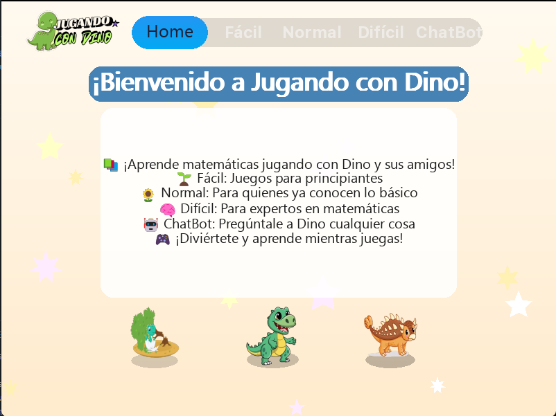
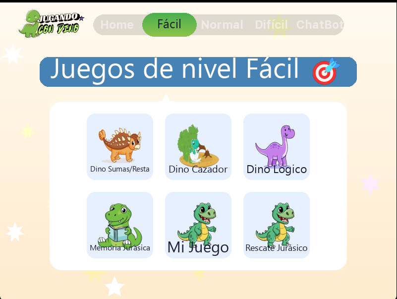
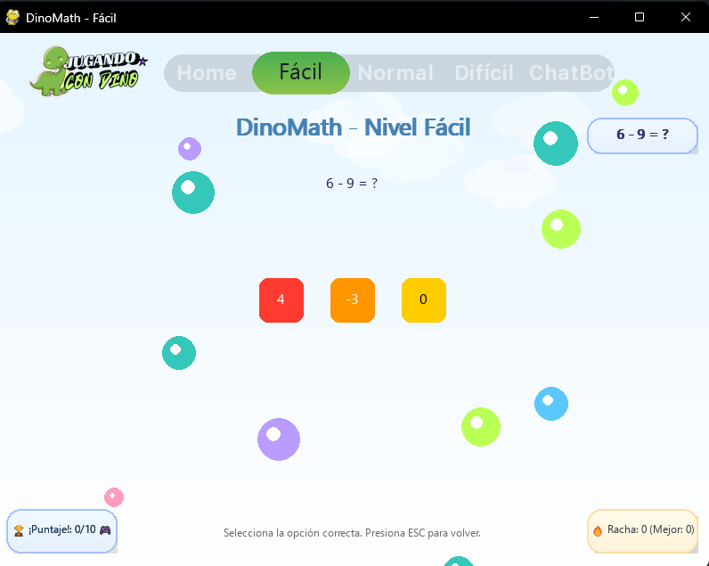
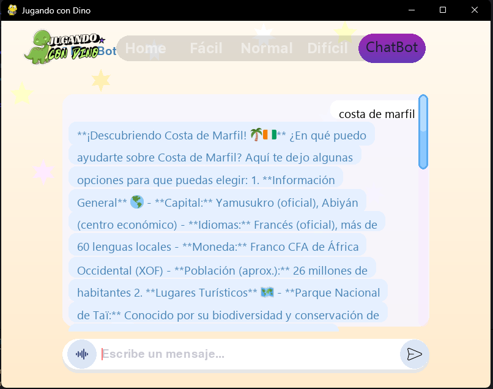

# Juego_Dino
Juego Educativo con tematica de Dinosaurios enfocado en niños entre 6 y 10 años.Proyectos con componentes de IA

Como Ejecutarlo
Creas un entorno Virtual: python3 -m venv .venv (cambia el nombre si quieres )
Activar el entorno
-Linux (codespace tambien aplica):
source .venv/bin/activate
-Windows: 
.venv\Scripts\Activate    
En caso de de que no te deje por la seguridad de windows pon el comando:
Set-ExecutionPolicy -ExecutionPolicy Bypass -Scope Process

Instala las libreria al entorno virtual: pip install -r requirements.txt

Listo ahora solo ejecuta main.py 

Para guardar las dependencias : 
-Ejecuta : pip freeze > requirements.txt

--Menu Principal--
-home

-selector game by nivel

--game example--

--chatbot--
